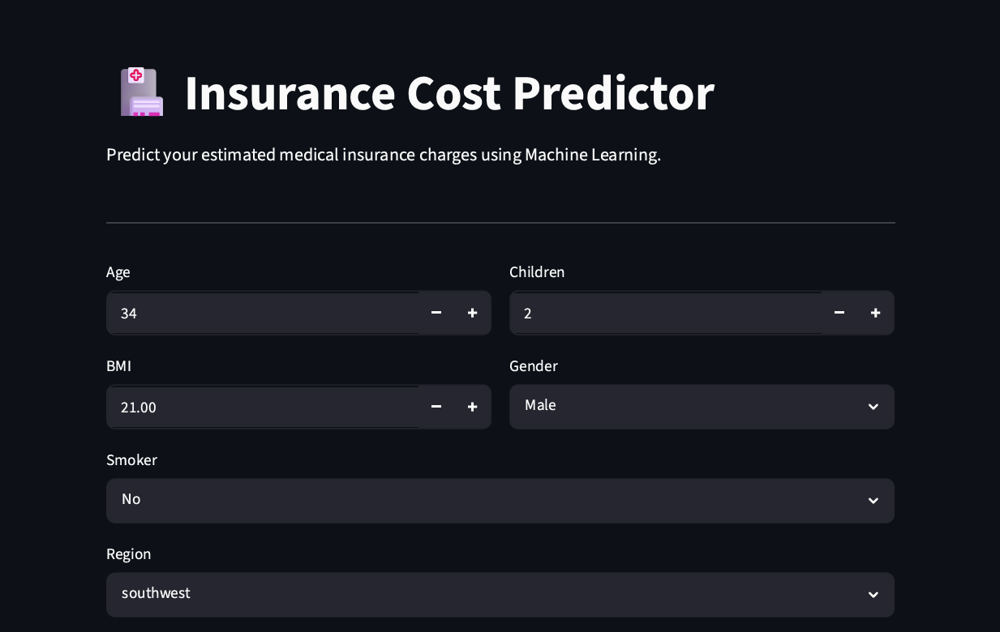
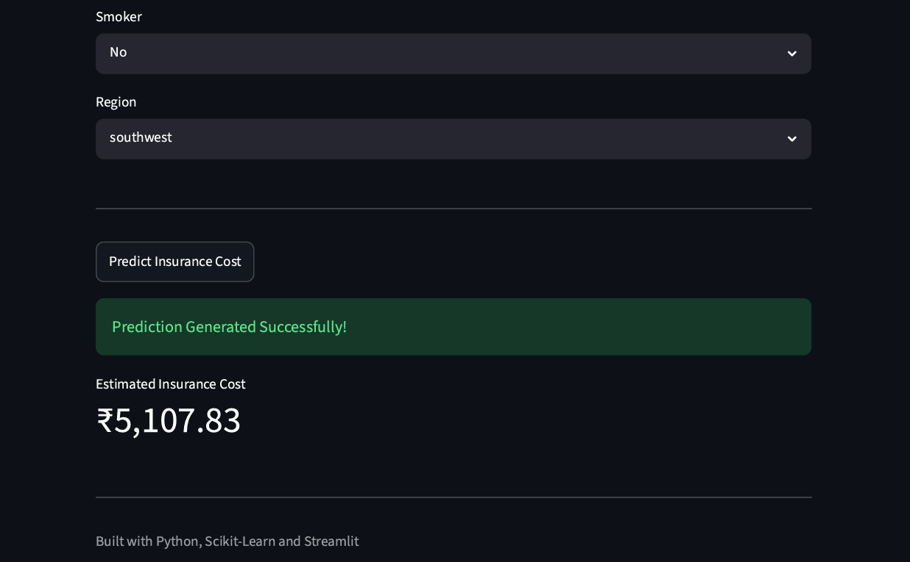

#  Insurance Cost Predictor

## Live Demo

https://insurance-cost-predictor-aq5dw24ht7r34ejfdzqdmv.streamlit.app/

---

## Overview

Insurance Cost Predictor is an end-to-end Machine Learning project that predicts medical insurance charges based on user information such as age, BMI, smoking status, number of children, gender, and region.

The project covers the complete ML workflow including:

* Exploratory Data Analysis (EDA)
* Data Cleaning
* Feature Engineering
* Feature Selection
* Model Training
* Model Evaluation
* Web App Deployment

---

## Features

✅ Predict insurance charges in real time

✅ Interactive Streamlit web application

✅ Feature engineering using BMI categories

✅ Statistical feature selection

✅ Cloud deployment using Streamlit Community Cloud

---

## Dataset Features

Input Features:

* Age
* Gender
* BMI
* Number of Children
* Smoker Status
* Region

Engineered Features:

* BMI Category (Obese)
* Region Encoding

---

## Machine Learning Workflow

### Data Preprocessing

* Removed duplicate records
* Encoded categorical variables
* Applied One-Hot Encoding
* Standardized numerical features using StandardScaler

### Feature Engineering

* Created BMI category features
* Generated obesity indicator feature

### Feature Selection

* Pearson Correlation Analysis
* Chi-Square Test

### Model

* Linear Regression

### Train-Test Split

* 80% Training Data
* 20% Testing Data

---

## Model Performance

| Metric            | Score |
| ----------------- | ----- |
| R² Score          | 0.804 |
| Adjusted R² Score | 0.799 |

The model explains approximately 80% of the variance in insurance charges.

---

## Tech Stack

* Python
* Pandas
* NumPy
* Scikit-learn
* SciPy
* Matplotlib
* Seaborn
* Streamlit
* Joblib

---

## Project Structure

```text
insurance-cost-predictor/
│
├── app.py
├── project.ipynb
├── insurance.csv
├── insurance_model.pkl
├── scaler.pkl
├── requirements.txt
├── README.md
└── project_demo.pdf
```
## Application Screenshots

### Home Page



### Prediction Result



## Project Demonstration

A PDF demonstration of the application is included in the repository:

```text
project_demo.pdf
```

---

## Deployment

The application is deployed using Streamlit Community Cloud.

Live Application:

https://insurance-cost-predictor-aq5dw24ht7r34ejfdzqdmv.streamlit.app/

---

## Author

**Parth Parashar**

B.Tech (Artificial Intelligence & Machine Learning)

Machine Learning and Software Development Enthusiast
